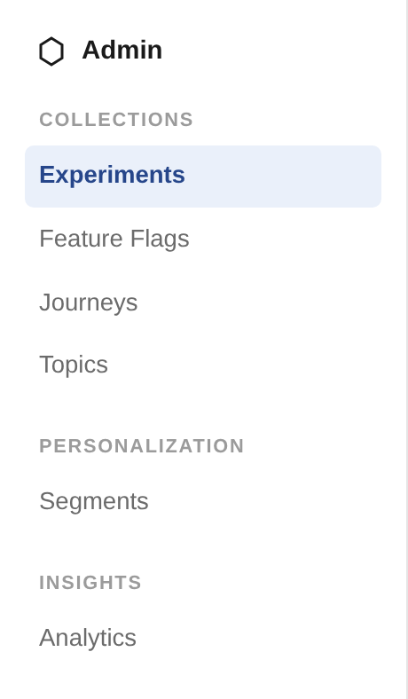
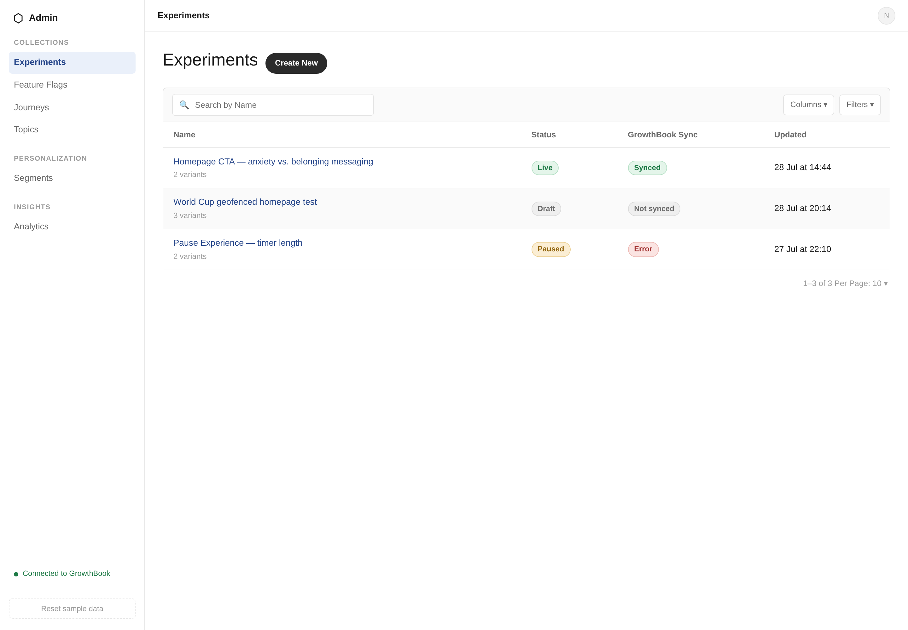
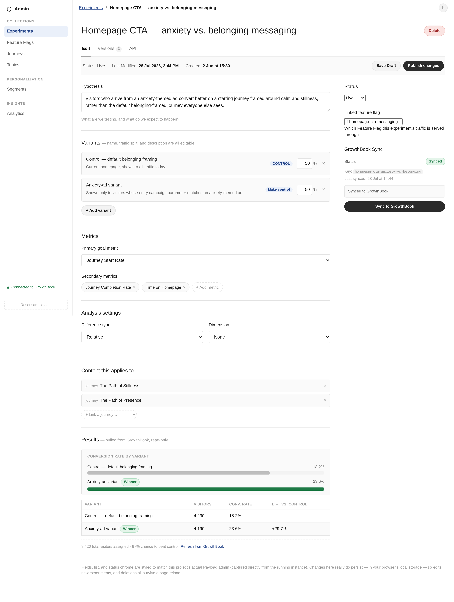
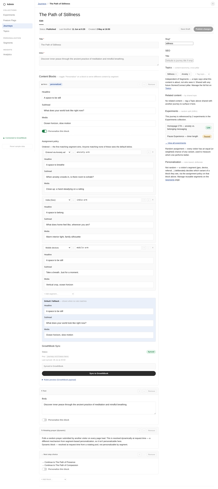
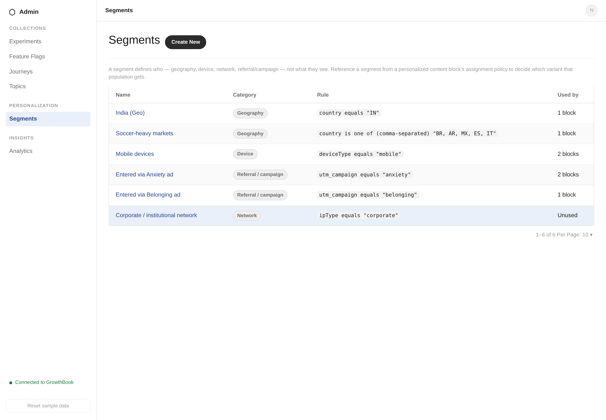
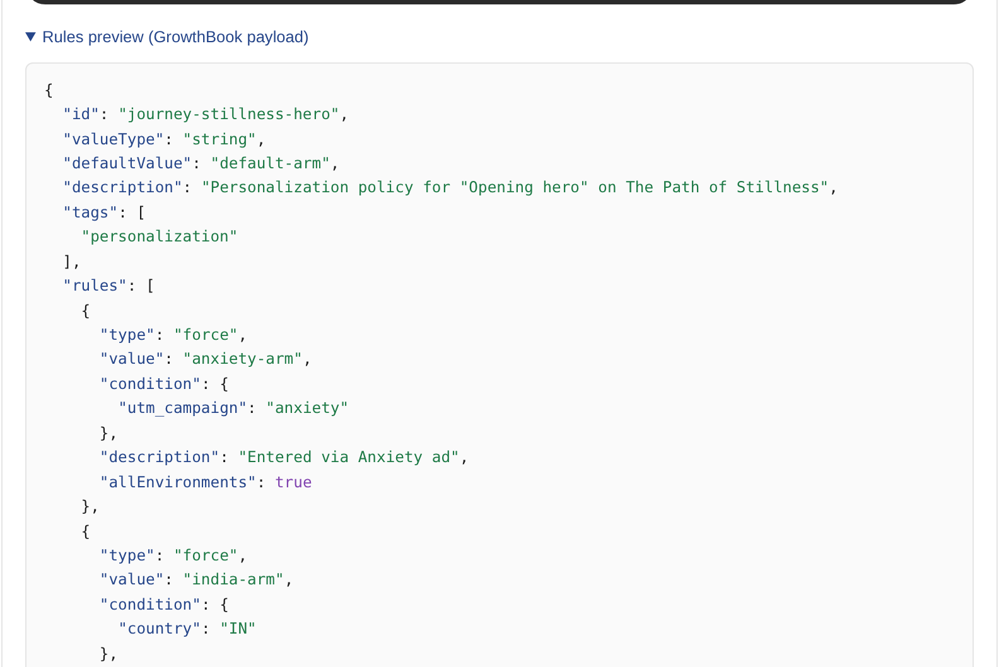
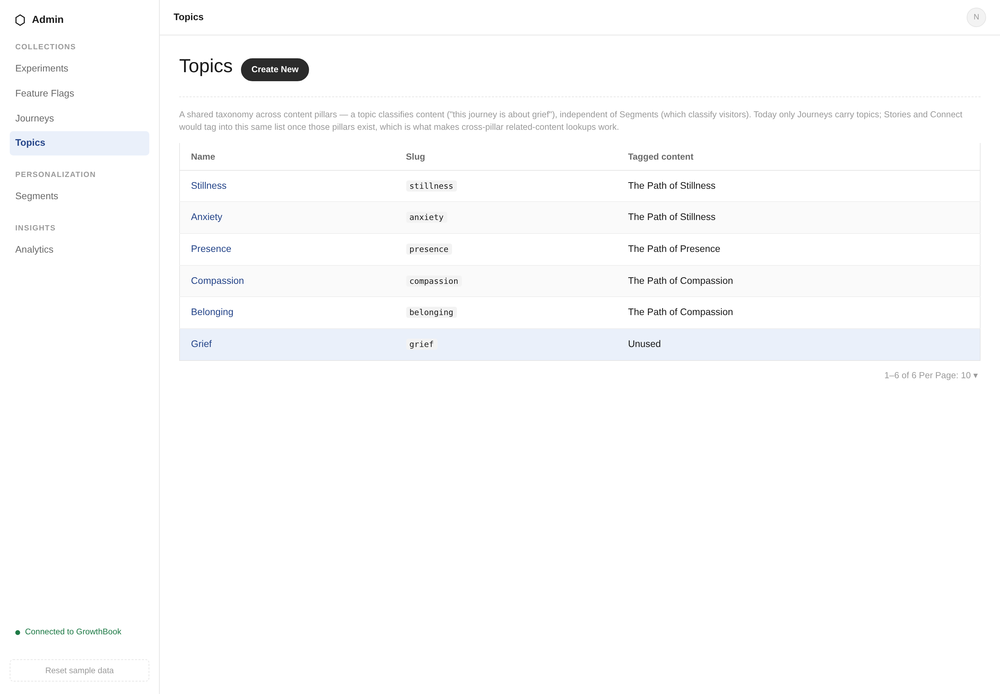
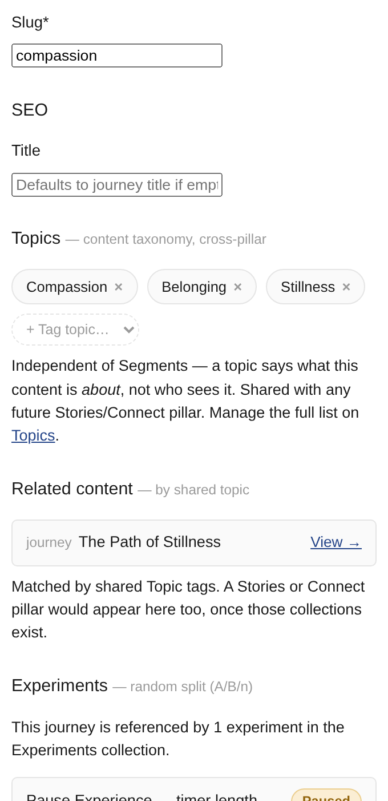

# Guide

**Live demo:** https://payload-admin-experimentation.vercel.app/

## Read this first: what this actually is

**This is not Payload CMS.** It's a prototype built to look and feel like
our real Payload admin — same layout, same components, same visual
language — so the team can click through a concrete version of the
Personalization, Recommendation, and Experimentation concepts before we
commit to building them for real. Under the hood it's a small standalone
app with no relation to the actual Payload codebase.

What it is not a prototype of: **the GrowthBook connection is real, and
this live link is actually connected to it.** When you hit "Sync to
GrowthBook" on a personalized block or an experiment, this app makes a
genuine API call to a real GrowthBook account — creating and updating real
Features there, not returning canned/fake responses. The sidebar shows
"Connected to GrowthBook" for exactly this reason — it isn't a mock status.

Data lives in your browser's local storage, not a shared server — everyone
who opens the link gets their own independent copy of the sample data.

---

## Navigation overview

Three groups in the sidebar:
- **Collections** — Experiments, Feature Flags, Journeys, Topics
- **Personalization** — Segments
- **Insights** — Analytics

The three concepts you asked about map onto this structure as follows.

---

## 1. Experimentation (A/B testing)

**Where:** Collections → Experiments

Classic A/B/n testing: two or more variants, a traffic-split weight per
variant, a stated hypothesis, a primary + secondary metric, and results
pulled in as a chart and table. A visitor's variant is decided **randomly**
— the whole point is to measure which one performs better.

Open one and you get the full editor: variants, metrics, analysis
settings, which journeys it applies to, a Versions history, an API tab,
and a GrowthBook Sync panel.

**How it reaches GrowthBook:** an Experiment becomes a GrowthBook Feature
whose value is split randomly across variants — standard A/B testing
mechanics.

---

## 2. Personalization

**Where:** Collections → Journeys (on a journey's Content Blocks) +
Personalization → Segments

This is the deliberate opposite of an A/B test: **not random.** A block's
content is chosen based on *who the visitor actually is* — their
geography, device, or the campaign they arrived from.

A journey is built from content blocks. Any block can be personalized —
switch it on and you get an **assignment policy**: an ordered list of
Segment → Variant rules (each with its own headline/media/copy), plus a
required default shown to anyone matching none of them.

The populations referenced above ("Entered via Anxiety ad," "India,"
"Mobile devices") are **Segments** — defined once, reused across any
number of blocks:

**How it reaches GrowthBook:** a personalization policy becomes a
*string-valued* GrowthBook Feature whose value comes from ordered `force`
rules — each rule's condition is generated directly from a Segment's
rule(s), and it deterministically forces one variant. Open "Rules preview"
on any personalized block to see the exact payload:

Same delivery mechanism as an Experiment (a GrowthBook Feature), different
assignment logic (deterministic instead of random).

---

## 3. Recommendation

**Where:** Collections → Topics, and the "Related content" panel on any
Journey

This is a third, independent mechanism — it doesn't touch GrowthBook at
all. **Topics** are a content taxonomy: tags describing what a piece of
content is *about* (Stillness, Anxiety, Presence, Compassion, Belonging,
Grief), completely separate from Segments (which describe *who's
looking*).

Tag a journey with one or more topics, and any other journey sharing at
least one topic automatically surfaces in its **Related content** panel —
this is the recommendation mechanism:

Today this only surfaces other Journeys, since that's the only content
type built so far — but it's built so any future content type could tag
into the same Topics list and start showing up here too, without changing
how the lookup itself works.

---

## The three, side by side

| | Experimentation | Personalization | Recommendation |
|---|---|---|---|
| Question it answers | Which version performs better? | What should *this* visitor see? | What else is relevant to *this* content? |
| Assignment | Random | Deliberate, rule-based | Tag-based lookup |
| Driven by | Traffic-split weights | Segments | Topics |
| Talks to GrowthBook? | Yes — random-split Feature | Yes — rule-based Feature | No — stays inside the CMS |

---

## Everything else in here

- **Feature Flags** (Collections → Feature Flags) — plain on/off switches
  per environment, sometimes linked to an Experiment, sometimes standalone.
- **Analytics** (Insights → Analytics) — a read-only sample dashboard;
  in a real build this would embed GrowthBook's own analytics.
- **Reset sample data** (bottom of the sidebar) — wipes any edits you made
  while exploring and restores the original sample data.
